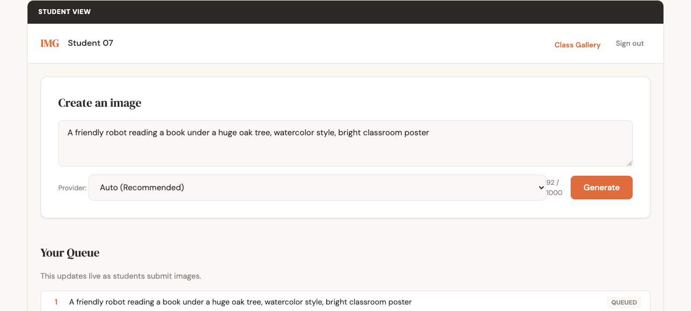
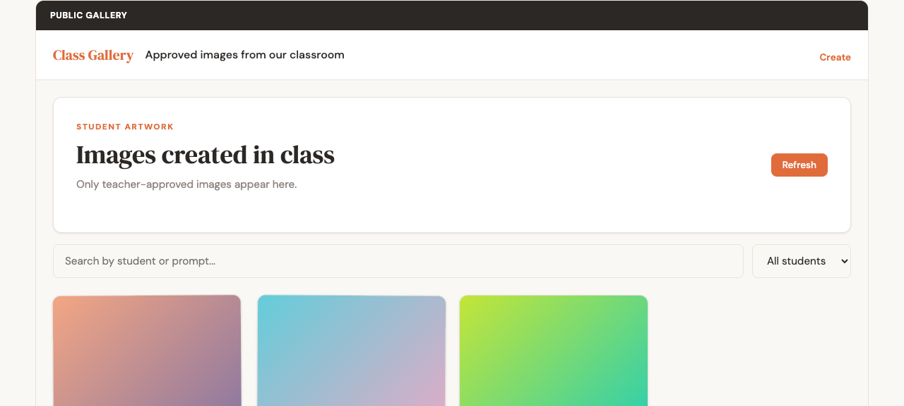
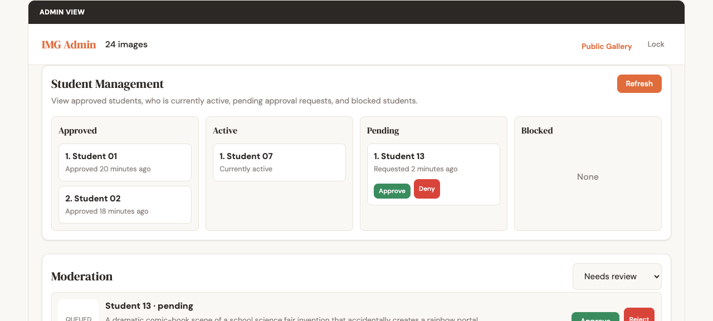

# Image Generator — School LAN Webserver

A lightweight Node.js/Express webserver that lets students on a school network sign in with their name, generate AI images from text prompts, and view their personal gallery. An admin page shows all generated images across all students.

Foxcode referral link: https://foxcode.rjj.cc/auth/register?aff=82E8OC

## Features

- **Student approval flow** — Teacher approves access before generation
- **Prompt-based image generation** — Students describe what they want to create
- **Queue system** — Handles up to 12+ simultaneous students by queuing generation jobs one at a time
- **Live status updates** — Students see queue position and "generating" status in real time via Server-Sent Events
- **Personal gallery** — Each student sees only their own generated images
- **Admin gallery** — Password-protected view of all images from all students, with search and filter
- **Public gallery** — Approved images only, accessible without login
- **Moderation** — Teacher can approve/reject images and edit filter terms
- **Trusted admin browsers** — Password plus trusted browser token
- **File naming** — Every image saved with date, time, and student name prefix for easy organization

## Screenshots

The screenshots below use anonymized demo data.

### Student View



### Public Gallery



### Admin View



## Resume Notes

- `.trash/` is the scratch workspace for anonymized mock pages and temporary screenshots.
- `docs/screenshots/` holds the committed screenshots used by this README.
- Do not add `.env`, `data/`, `images/`, `.screenshots/`, or `.trash/` to Git.
- If work needs to resume later, start by checking `agent.md` and `project.md` for the current system state and watchouts.

## Quick Start

```bash
npm install
```

Set your API key in the computer environment before starting the server:

```bash
export FOXCODE_API_KEY="your-key-here"
```

Optional environment variables:

```bash
export PORT=3000              # server port (default 3000)
export HOST=0.0.0.0           # bind address (default 0.0.0.0)
export ADMIN_PASSWORD=admin   # admin page password (default "admin")
export IMAGE_SIZE=1024x1024   # 1024x1024, 1536x1024, 1024x1536
export IMAGE_QUALITY=medium   # low, medium, high
```

Start the server:

```bash
npm start
```

Or for development with auto-reload:

```bash
npm run dev
```

## Usage

### Student Flow

1. Open `http://<server-ip>:3000` in a browser
2. Enter your name and click **Start**
3. Type a prompt (e.g. "a red dragon flying over a castle")
4. Click **Generate**
5. Wait in the queue — you'll see your position update live
6. Your image appears in your gallery below

### Admin Flow

1. Open `http://<server-ip>:3000/admin` in a browser
2. Enter the admin password (default: `admin`)
3. View all images from all students
4. Use filters to search by student name, prompt text, or status

## Architecture

```
server.js         — Express routes and SSE event stream
queue.js          — In-memory job queue (1 worker, serial processing)
imageGenerator.js — Foxcode API integration + image download
storage.js        — JSON file metadata store
config.js         — Environment-based configuration
public/           — Static frontend (HTML, CSS, JS)
images/           — Generated image files (auto-created)
data/             — Metadata JSON file (auto-created)
```

### Queue Design

- Jobs enter the queue with status `queued`
- One worker processes jobs serially (one at a time)
- When a job starts, status becomes `generating`
- On success: status `complete`, image saved locally
- On failure: status `failed`, error recorded
- All status changes are broadcast via SSE to all connected clients

### Image File Naming

Format: `YYYY-MM-DD_HH-MM-SS_StudentName_image-id.png`

Example: `2026-05-15_14-30-22_Alice_Smith_880a0abd-98b2-474b-975a-9e0b938ef8af.png`

Files are stored in the `images/` directory.

## API Endpoints

| Method | Endpoint | Description |
|--------|----------|-------------|
| POST | `/api/signin` | Sign in with name |
| POST | `/api/generate` | Submit a prompt for image generation |
| GET | `/api/images?studentName=...` | Get student's images |
| GET | `/api/public/gallery` | Get approved public images |
| GET | `/api/admin/images?password=...` | Get all images (admin) |
| GET | `/api/admin/students?password=...` | Get approved, active, pending, and blocked students |
| GET | `/api/admin/moderation?password=...` | Get images waiting for moderation |
| POST | `/api/admin/moderate/:id?password=...` | Approve or reject an image |
| GET | `/api/admin/tokens?password=...` | List trusted admin browsers |
| POST | `/api/admin/enrollment-code?password=...` | Generate an add-browser code |
| GET | `/api/queue/status` | Get current queue snapshot |
| GET | `/api/queue/events` | SSE stream for live updates |
| GET | `/api/config` | Server configuration status |

## Security Notes

- API key is never exposed to the browser — all generation happens server-side
- Admin page uses password plus trusted browser tokens after enrollment
- Student names are display names, not verified identities
- Generated images are stored server-side only

## Customization

### Change Admin Password

```bash
export ADMIN_PASSWORD=mysupersecretpassword
```

### Change Image Size/Quality

```bash
export IMAGE_SIZE=1536x1024
export IMAGE_QUALITY=high
```

### Use Foxcode/OpenAI-Compatible Endpoint

```bash
export FOXCODE_API_KEY="your-key-here"
```

## Troubleshooting

### "API key not configured" warning

Set `FOXCODE_API_KEY` in the computer environment before starting the server.

### Images not generating

- Check that the API key is valid
- Check server logs for error messages
- Verify the server can reach `https://dm-fox.rjj.cc`

### Port already in use

The server automatically finds the next available port if 3000 is taken.

## Dependencies

- express — Web framework
- uuid — Unique ID generation
- (no build step required — pure HTML/CSS/JS frontend)

## License

ISC
